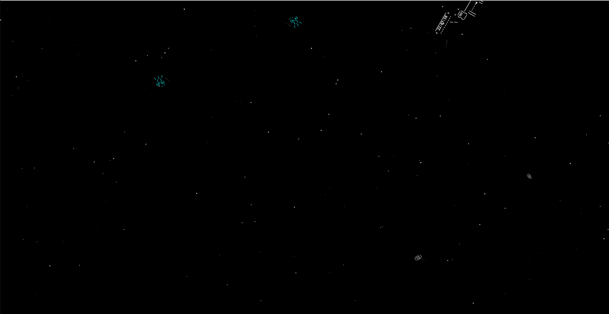

# Telemetrik

Visualizador espacial de actividad web en tiempo real

Telemetrik combina un backend FastAPI y una interfaz web interactiva para mostrar la actividad de tu aplicación como una animación espacial. 
En la pantalla, habrá partículas que representan eventos moviéndose de izquierda a derecha, junto con elementos animados como cometas, asteroides, satélites ASCII y vacas "cowsay" que cruzan el espacio cada tanto diciendo la hora. El fondo estrellado y los efectos visuales hacen que cada evento registrado se convierta en una partícula con color y código propio, permitiendo una experiencia visual atractiva y divertida para monitorear la actividad web.

Este proyecto contiene backend en FastAPI para generar y distribuir eventos en forma de partículas, pensado para visualizar actividad web en tiempo real.

Las partículas recorren la pantalla de izquierda a derecha, e incluyen cometas, satélites, asteroides y vacas locas.



## Características principales
- **API REST** para registrar eventos de estado HTTP (200, 404, 500, etc.)
- **Configuración dinámica** de códigos de estado y colores asociados
- **Cola de eventos** en memoria, con endpoint de polling para obtener eventos recientes
- **Documentación interactiva** disponible en `/docs` (Swagger UI)
- **Servidor de archivos estáticos** para la visualización web

## Endpoints principales

- `GET /api/{status_code}`: Genera un evento de partícula con el código de estado indicado (ejemplo: 200, 404). El color se define en la configuración.
- `POST /api/config/add_code`: Permite agregar o actualizar un código de estado y su color asociado. Ejemplo de payload:
  ```json
  {
    "code": 418,
    "color": "hotpink"
  }
  ```
- `GET /api/events/poll`: Devuelve todos los eventos acumulados y vacía la cola.
- `GET /`: Redirige a la interfaz web en `/static/index.html`.

## Ejecución

1. Instala las dependencias:
   ```powershell
   pip install -r requirements.txt
   ```
2. Ejecuta el servidor:
   ```powershell
   python main.py
   ```
3. Accede a la documentación interactiva en [http://127.0.0.1:8000/docs](http://127.0.0.1:8000/docs)
4. Visualiza la actividad en [http://127.0.0.1:8000/static/index.html](http://127.0.0.1:8000/static/index.html)

## Estructura del proyecto

```
main.py               # Backend FastAPI
requirements.txt      # Dependencias
static/index.html     # Interfaz web principal
static/oldindex.html  # Versión estable de la interfaz
```

## Notas
- Los colores deben ser nombres CSS válidos o valores hexadecimales.
- La cola de eventos se almacena en memoria y se vacía tras cada polling.
- El servidor se ejecuta con recarga automática (`reload=True`).

---
Desarrollado por Juan.
